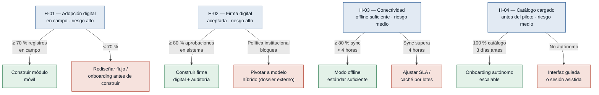
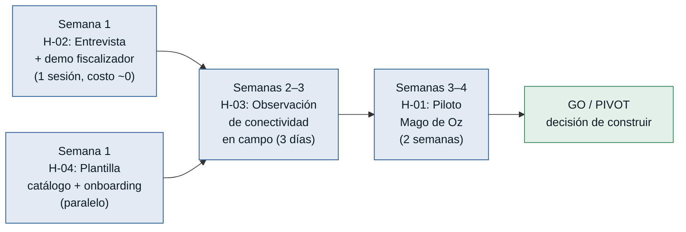

# Hipótesis y Experimentos — Liberaciones de Obra

Generado el 2026-06-21. Fuente: `mvp-canvas.md`, `requisitos.md`, `evidence-map.json`.
Ordenadas de mayor a menor riesgo: primero se prueba lo que más puede tumbar el MVP.

---

## Árbol de decisión general

---

### [H-01] Inspectores adoptan el registro digital en campo — riesgo: alto

- **Supuesto a probar:** Los inspectores de calidad adoptarán el registro digital de observaciones en campo (móvil, foto, flujo) en lugar de papel y WhatsApp, sin retrabajo posterior.
- **Hipótesis:** Creemos que el Inspector de Calidad registrará observaciones con foto directamente desde el móvil en el momento de la inspección si el flujo no supera 3 pasos y funciona offline, porque la barrera declarada no es la voluntad sino la ausencia de una herramienta que no añada retrabajo ni dependa de conectividad.
- **Señal medible:** Porcentaje de observaciones registradas digitalmente en campo el mismo día de la inspección, sobre el total de observaciones generadas en ese período (excluye registros hechos a posteriori o por canales externos).
- **Criterio de éxito:** ≥ 70 % de las observaciones de un inspector piloto registradas digitalmente en campo durante las primeras 2 semanas de uso real.
- **Experimento:** Mago de Oz / Concierge — un inspector piloto usa la app (prototipo funcional mínimo o formulario offline) durante 2 semanas en frentes reales; un facilitador acompaña jornada y media la primera semana para observar fricciones y registrar barreras de uso.
- **Caja de tiempo/costo:** 2 semanas · 1 inspector piloto · ~6 horas de facilitación en campo.
- **Regla de decisión:**
  - Si pasa → construir el módulo de registro móvil con el flujo validado como prioridad de desarrollo.
  - Si falla → identificar la fricción específica (flujo demasiado largo, problema de conectividad, resistencia cultural) y rediseñar el onboarding o simplificar el flujo antes de construir; no lanzar el MVP hasta superar el umbral.

> **Por qué es la #1:** Si los inspectores no registran en campo, el sistema no tiene datos y toda la cadena de valor cae. Es el riesgo de adopción más alto y el único que los demás actores no pueden compensar.

---

### [H-02] El fiscalizador acepta la firma digital como respaldo documental — riesgo: alto

- **Supuesto a probar:** El Fiscalizador del Cliente aceptará la firma digital generada por el sistema como respaldo documental válido ante su auditoría interna, sin necesidad de papel ni de aprobación por correo.
- **Hipótesis:** Creemos que el Fiscalizador del Cliente aprobará solicitudes de liberación usando la firma digital del sistema si el sistema genera un registro de auditoría inmutable con evidencia fotográfica y marca de tiempo, porque su rechazo actual a aprobar fuera del papel se debe a la falta de trazabilidad en los canales actuales, no a una política institucional explícita contra firmas digitales.
- **Señal medible:** Porcentaje de solicitudes de liberación aprobadas por el fiscalizador mediante firma digital dentro del sistema, sobre el total de solicitudes en estado listo para aprobación durante el piloto.
- **Criterio de éxito:** ≥ 80 % de las aprobaciones del fiscalizador piloto realizadas dentro del sistema en las primeras 4 semanas; 0 devoluciones por falta de valor documental del registro digital.
- **Experimento:** Entrevista dirigida + demo de prototipo — sesión de 60–90 minutos con el fiscalizador mostrando el flujo de aprobación con registro de auditoría (foto antes/después, firma digital, trazabilidad de cambios). El objetivo es detectar si hay una objeción de política interna o si la barrera es la confianza en la herramienta.
- **Caja de tiempo/costo:** 1 semana · 1 entrevista + 1 demo · costo prácticamente cero (sin construir nada).
- **Regla de decisión:**
  - Si pasa → construir el módulo de firma digital y aprobación con los campos de auditoría requeridos (R-12).
  - Si falla por política institucional → pivotar a modelo híbrido: el sistema genera el dossier completo y el fiscalizador lo firma fuera del sistema; ajustar el MVP Canvas y descartar R-12 del alcance del MVP.

> **Por qué es la #2:** El cierre formal del ciclo de liberación depende del fiscalizador. Si no puede aprobar dentro del sistema, el MVP no elimina el papel ni el correo como canales de cierre, y la propuesta de valor queda incompleta.

---

### [H-03] La conectividad en campo permite sincronización en menos de 4 horas — riesgo: medio

- **Supuesto a probar:** La conectividad en los frentes de obra es intermitente pero no inexistente: un inspector con la app en modo offline puede sincronizar sus registros en menos de 4 horas promedio durante la jornada.
- **Hipótesis:** Creemos que el Inspector de Calidad sincronizará los registros offline generados en campo en menos de 4 horas promedio si accede a señal al menos una vez por jornada de trabajo (en zona de acopio, instalaciones o traslado), porque las entrevistas describen conectividad intermitente —no ausente— y los inspectores se desplazan entre frentes a lo largo del día.
- **Señal medible:** Tiempo promedio transcurrido en horas entre el registro offline de una observación en campo y su sincronización al servidor, medido durante observación directa en campo.
- **Criterio de éxito:** ≥ 80 % de los registros offline sincronizados en menos de 4 horas en condiciones reales, a lo largo de 3 jornadas de observación.
- **Experimento:** Observación de campo — acompañar al inspector durante 3 jornadas completas en los frentes del proyecto; registrar manualmente los períodos con y sin conectividad y medir el tiempo real hasta recuperar señal para cada registro offline generado.
- **Caja de tiempo/costo:** 3 días hábiles · 1 facilitador en campo · sin costo de software.
- **Regla de decisión:**
  - Si pasa → el modo offline estándar (sincronización automática al recuperar señal) es suficiente; construir según R-16.
  - Si falla → evaluar caché local más agresivo, mecanismo de sincronización por lotes al inicio/fin de jornada, o redefinir el SLA de visibilidad en tiempo real para el MVP antes de construir.

> **Por qué es la #3:** El modo offline es una funcionalidad mínima del MVP (R-16). Si la conectividad es peor de lo declarado, el diseño técnico cambia, pero el riesgo de negocio es menor que los dos anteriores porque no tumba la adopción, solo la retrasa.

---

### [H-04] La organización carga el catálogo de frentes/actividades antes del piloto — riesgo: medio

- **Supuesto a probar:** La organización (Jefe de Proyecto / Coordinadora Documental) definirá y cargará el catálogo de frentes y actividades del piloto en el sistema antes de la fecha de inicio, sin intervención técnica del equipo de desarrollo.
- **Hipótesis:** Creemos que el Jefe de Proyecto o la Coordinadora Documental cargará el catálogo completo de frentes y actividades del piloto antes del arranque si se les provee una plantilla Excel de importación y una sesión de onboarding de 2 horas, porque el catálogo ya existe en planillas internas del proyecto y la barrera es la migración de formato, no la definición del contenido.
- **Señal medible:** Porcentaje del catálogo de frentes y actividades del piloto cargado correctamente en el sistema (sin errores de nomenclatura) antes de la fecha de inicio del piloto.
- **Criterio de éxito:** 100 % del catálogo del alcance del piloto cargado al menos 3 días antes de la fecha de inicio, sin intervención técnica del equipo de desarrollo.
- **Experimento:** Fake door + onboarding observado — entregar la plantilla de importación al Jefe de Proyecto y la Coordinadora Documental con instrucciones escritas y 1 sesión de onboarding de 2 horas; medir si completan la carga autónomamente dentro de los 3 días siguientes.
- **Caja de tiempo/costo:** 1 semana · 1 plantilla Excel + 1 sesión de onboarding de 2 horas.
- **Regla de decisión:**
  - Si pasa → confirmar que el onboarding de catálogo es autónomo y escalable; documentar la plantilla como parte del kit de arranque.
  - Si falla → simplificar el formato de importación, crear una interfaz de carga guiada más simple sin Excel, o incluir una sesión de configuración asistida como parte del proceso de activación del sistema.

> **Por qué es la #4:** Sin catálogo cargado el piloto no puede arrancar, pero es el supuesto más controlable: la organización tiene el contenido y el equipo puede ofrecer una sesión de apoyo. El riesgo es operativo, no de validez de la propuesta de valor.

---

## Secuencia recomendada de experimentos

> H-02 y H-04 se pueden correr en paralelo la primera semana porque son independientes entre sí y de bajo costo. H-03 requiere acceso a campo. H-01 es el experimento más largo y el que da la señal definitiva: se corre último para no construir antes de saber si el inspector adopta.
