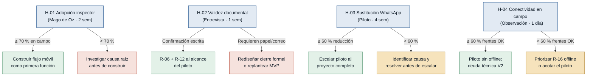

# Hipótesis y Experimentos — Liberaciones de Obra

Generado el 2026-06-21. Basado en `mvp-canvas.md` y 5 entrevistas de primera mano.
Ordenadas de mayor a menor riesgo. Probar en este orden: lo que más puede tumbar
el MVP va primero.

---

## Árbol de decisión general

---

### [H-01] Adopción del inspector en campo — riesgo: alto

- **Supuesto a probar:** El inspector de calidad registrará observaciones y
  evidencias en el sistema móvil durante la inspección, en lugar de tomar fotos
  con el celular y ordenarlas al final del día.
- **Hipótesis:** Creemos que el inspector de calidad registrará sus observaciones
  en el momento de la inspección si cuenta con un formulario móvil de máximo 3
  campos requeridos más foto, porque la fricción identificada es la complejidad del
  flujo y el tiempo de carga, no la disposición a registrar. (`inspector_calidad.md`)
- **Señal medible:** Porcentaje de observaciones registradas en campo (antes de
  regresar a la oficina) sobre el total de observaciones del día, comparado con la
  línea base de la semana previa al piloto. Esta señal le permite al jefe de
  proyecto decidir si el inspector está usando el sistema como canal principal o
  como canal paralelo al papel.
- **Criterio de éxito:** ≥ 70 % de las observaciones registradas en campo durante
  las semanas 2 y 3 del experimento (2 semanas de medición).
- **Experimento:** Mago de Oz — desplegar un formulario Google Forms ultra-simple
  (código de actividad + descripción + foto adjunta) compartido solo con los
  inspectores. Un operador centraliza las respuestas en un tracker compartido. Sin
  construir la app. Se mide si los inspectores envían el formulario desde el frente
  o al llegar a la oficina comparando la hora del envío con el horario de campo.
- **Caja de tiempo/costo:** 3 semanas (1 de preparación + 2 de medición). Costo:
  4 h/semana de un operador para consolidar respuestas. Sin desarrollo de software.
- **Regla de decisión:** Si pasa (≥ 70 % en campo) → construir el flujo móvil como
  primera funcionalidad del MVP; el formulario de 3 campos confirma el mínimo viable
  de UX. Si falla (< 70 %) → no construir la app todavía; investigar si la barrera
  es el formulario (simplificar), la conectividad (levantar H-04 primero) o la
  cultura de registro (requiere cambio de proceso antes de tecnología); redefinir
  el MVP según la causa raíz encontrada.

---

### [H-02] Validez documental de la aprobación digital — riesgo: alto

- **Supuesto a probar:** La aprobación que el fiscalizador del cliente registra en
  el sistema digital tiene valor documental suficiente ante las auditorías internas
  del cliente.
- **Hipótesis:** Creemos que el fiscalizador del cliente aceptará usar el sistema
  como canal formal de aprobación si el registro incluye su identidad, timestamp y
  el identificador del documento aprobado, porque el único requisito que menciona
  para confiar en un canal digital es la trazabilidad inmutable de quién aprobó qué
  y cuándo. (`fiscalizador_cliente.md`)
- **Señal medible:** Confirmación explícita (por escrito: correo o minuta) del
  fiscalizador y su área contractual de que el registro digital es válido como
  respaldo ante su auditoría interna. Esta señal le permite al equipo decidir si
  el MVP cierra el ciclo de aprobación o si necesita un canal de correo
  autogenerado como capa adicional.
- **Criterio de éxito:** 100 % de confirmación: el fiscalizador y al menos un
  representante del área contractual del cliente confirman por escrito que el
  registro digital (identidad + timestamp + ID de documento) es suficiente. Sin
  ese acuerdo, el piloto no arranca.
- **Experimento:** Entrevista dirigida de 1 hora con el fiscalizador + revisión de
  las cláusulas de aprobación del contrato de obra. Se presenta la propuesta
  concreta: pantallazos del diseño del registro digital y la pregunta directa de si
  ese registro sería suficiente ante una auditoría. Si el fiscalizador no tiene la
  autoridad, se escala a su área legal con la misma propuesta en la misma semana.
- **Caja de tiempo/costo:** 1 semana. Costo: 1-2 reuniones de 1 hora. Sin
  desarrollo de software.
- **Regla de decisión:** Si pasa (confirmación escrita) → incluir registro de
  identidad + timestamp + ID de documento como requisito técnico irremplazable del
  MVP; R-06 y R-12 entran al alcance del piloto. Si falla (el cliente exige firma
  en papel o correo formal) → rediseñar el flujo para que el sistema genere
  automáticamente un correo de confirmación firmado al aprobar, o descartar la
  aprobación digital como canal formal y redefinir el MVP hacia coordinación sin
  cierre legal.

---

### [H-03] Sustitución de WhatsApp como canal de coordinación — riesgo: medio

- **Supuesto a probar:** Los usuarios dejarán de usar WhatsApp para coordinar
  observaciones y liberaciones una vez que el sistema esté disponible y emita
  notificaciones de cambio de estado.
- **Hipótesis:** Creemos que el residente de obra y el inspector de calidad
  reducirán su uso de WhatsApp para coordinar liberaciones si el sistema envía
  notificaciones instantáneas de cambio de estado, porque la razón que los mantiene
  en WhatsApp es la velocidad de respuesta, no la preferencia por el canal.
  (`residente_obra.md`, `inspector_calidad.md`)
- **Señal medible:** Número de mensajes de coordinación de liberaciones enviados en
  los grupos de WhatsApp de obra durante las semanas del piloto, comparado con el
  conteo de la semana baseline (muestra manual, dos veces por semana). Esta señal
  le permite al jefe de proyecto decidir cuándo anunciar el retiro del grupo de
  WhatsApp de coordinación.
- **Criterio de éxito:** Reducción de ≥ 60 % en mensajes de coordinación de
  liberaciones en WhatsApp en la semana 4 del piloto vs. la semana baseline.
- **Experimento:** Piloto acotado de 4 semanas con 5 usuarios representativos (1
  inspector, 1 residente, 1 fiscalizador, 1 jefe de proyecto, 1 coordinadora)
  usando el sistema en paralelo con WhatsApp. Conteo manual de mensajes de
  coordinación de liberaciones en el grupo de obra dos veces por semana. En la
  semana 2 se hace una pregunta directa a cada usuario: ¿por qué usaste WhatsApp
  para algo que podría ir en el sistema?
- **Caja de tiempo/costo:** 4 semanas. Costo: 2 h/semana de seguimiento manual.
  Requiere que el MVP esté operativo (depende de H-01 y H-02).
- **Regla de decisión:** Si pasa (≥ 60 % de reducción) → escalar el piloto al
  proyecto completo y fijar la fecha objetivo de desactivación del grupo de
  WhatsApp de coordinación. Si falla (< 60 %) → identificar la causa: si es
  lentitud de notificaciones, optimizarlas antes de escalar; si es desconfianza en
  los datos del sistema, revisar si la información se percibe como incompleta; no
  escalar el piloto hasta resolver la causa raíz encontrada.

---

### [H-04] Conectividad suficiente en campo para el piloto — riesgo: bajo

- **Supuesto a probar:** El inspector tiene conectividad de datos suficiente durante
  al menos el 60 % de su tiempo en los frentes activos para cargar fotos sin
  necesitar modo offline en la etapa piloto.
- **Hipótesis:** Creemos que el inspector podrá registrar observaciones con foto en
  tiempo real si la zona de obra tiene cobertura de datos suficiente en ≥ 60 % de
  los frentes activos, porque la falta de conectividad mencionada es puntual (zonas
  enterradas, sótanos) y no generalizada en toda la obra. (`inspector_calidad.md`)
- **Señal medible:** Porcentaje de frentes activos donde una foto de 2 MB se carga
  exitosamente en menos de 30 segundos con el celular del inspector durante horario
  laboral. Esta señal le permite al equipo decidir si el piloto puede arrancar sin
  modo offline o si R-16 entra al alcance inmediato.
- **Criterio de éxito:** ≥ 60 % de los frentes activos verificados tienen cobertura
  suficiente (foto de 2 MB cargada en < 30 s) en al menos 2 mediciones durante
  horario laboral.
- **Experimento:** Observación directa de 1 jornada completa acompañando al
  inspector en sus frentes habituales. En cada frente se intenta cargar una foto de
  2 MB y se registra la duración y si fue exitosa. Sin ningún desarrollo. 1 día de
  trabajo de un miembro del equipo.
- **Caja de tiempo/costo:** 1 día. Sin costo de desarrollo. Recomendado hacerlo
  antes de iniciar H-01 para no contaminar los resultados con problemas de
  conectividad.
- **Regla de decisión:** Si pasa (≥ 60 % de frentes con cobertura) → el piloto
  procede sin modo offline; se documenta la lista de frentes sin cobertura como
  restricción operativa del piloto y se registra R-16 como deuda técnica para V2.
  Si falla (< 60 %) → priorizar el desarrollo de modo offline (R-16) antes de
  lanzar el piloto, o acotar el piloto exclusivamente a los frentes con cobertura
  verificada mientras se construye la funcionalidad offline.

---

## Resumen de experimentos

| # | Hipótesis | Riesgo | Tipo de experimento | Costo estimado | Prerrequisito |
|---|---|---|---|---|---|
| H-01 | Adopción del inspector en campo | alto | Mago de Oz | 3 sem · 4 h/sem operador | H-04 (verificar conectividad) |
| H-02 | Validez documental aprobación digital | alto | Entrevista dirigida | 1 sem · 2 reuniones | Ninguno |
| H-03 | Sustitución de WhatsApp | medio | Piloto acotado | 4 sem · 2 h/sem seguimiento | H-01 y H-02 aprobados |
| H-04 | Conectividad en campo | bajo | Observación directa | 1 día | Ninguno |

**Secuencia recomendada:** H-04 y H-02 en paralelo (ninguna tiene prerrequisitos y
ambas son baratas) → H-01 → H-03. Si H-01 o H-02 fallan, replantear el MVP antes
de invertir en H-03.
