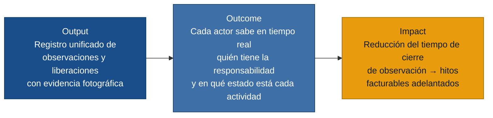
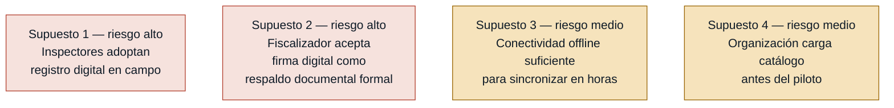

# MVP Canvas — Sistema de Liberaciones de Obra

Generado el 2026-06-21. Fuente: `personas.md`, `requisitos.md`, `evidence-map.json`.

---

## Cadena output → outcome → impact

---

## Canvas

| Bloque | Contenido |
|---|---|
| **Propuesta de valor** | Reemplazar WhatsApp, correos y minutas con un canal único donde el inspector registra observaciones con evidencia fotográfica en campo, todos ven en tiempo real quién tiene la responsabilidad, y el fiscalizador aprueba sobre evidencia completa con firma digital. Fin de las observaciones repetidas, las actividades bloqueadas sin aviso y los dossiers armados a último momento. |
| **Segmento de usuarios** | **Primarios (escriben y deciden):** Inspector de Calidad, Residente de Obra, Fiscalizador del Cliente. **Secundarios (consumen visibilidad):** Jefe de Proyecto, Coordinadora Documental. |
| **Funcionalidades mínimas** | 1. Registro de solicitud de liberación por actividad/frente con flujo de estados (solicitado → observado → corregido → liberado). 2. Registro de observación desde móvil con foto obligatoria, responsable y fecha compromiso. 3. Vista de estado por frente: quién tiene la pelota en tiempo real. 4. Control de roles: solo calidad o fiscalizador pueden cerrar una observación o pasar a "liberado". 5. Modo offline con sincronización automática al recuperar conectividad. |
| **Resultado esperado (outcome)** | El Inspector cierra sus observaciones del día desde campo sin retrabajo posterior. El Residente conoce antes de las 7 a.m. qué actividades están bloqueadas. El Fiscalizador aprueba sobre evidencia completa y no devuelve solicitudes por información faltante. |
| **Métrica de éxito** | **Primaria:** Tiempo promedio de cierre de observación (días transcurridos desde el registro de la observación hasta que el estado cambia a "liberado"), con meta de reducción ≥ 40 % en las primeras 4 semanas de uso respecto a la línea base declarada en entrevistas. Si baja, el Jefe de Proyecto puede decidir adelantar el siguiente hito de facturación. **Secundaria:** Porcentaje de solicitudes de liberación devueltas por el fiscalizador por información incompleta, con meta de caer por debajo del 10 % en el primer mes. Si baja, el Fiscalizador puede decir que aprueba sin rondas adicionales. |
| **Riesgos / supuestos** | 1. Los inspectores adoptarán el registro digital en campo en lugar de papel y WhatsApp (riesgo de adopción — el mayor). 2. El Fiscalizador del Cliente aceptará la firma digital del sistema como respaldo documental válido ante su auditoría interna. 3. La conectividad en frente es intermitente pero no inexistente: el modo offline sincroniza en horas, no en días. 4. La organización definirá y cargará un catálogo de frentes/actividades antes del piloto. |
| **Fuera de alcance (por ahora)** | Ver tabla debajo. |

---

## Fuera de alcance por ahora

| Funcionalidad | Por qué queda fuera |
|---|---|
| Exportación de reportes en PDF/Excel | El valor central es el flujo de registro y aprobación, no el reporte. Se agrega en la siguiente iteración cuando existan datos acumulados para exportar. |
| Dashboard analítico con ranking de responsables por días promedio de cierre | Requiere historial en el sistema; no aplica en el primer mes de adopción. |
| Descarga masiva autónoma de evidencia por el fiscalizador | El fiscalizador accede a la evidencia desde el sistema; la descarga masiva es comodidad, no bloqueo del flujo principal. |
| Notificaciones push automáticas al inicio de jornada | Cubierto parcialmente por la vista de estado en tiempo real; la notificación activa espera a que haya una base de usuarios estable. |
| Integración con sistemas de planificación (Primavera, MS Project) | Fuera del alcance de este ciclo; no hay evidencia de que sea bloqueante para el MVP. |
| Gestión de actas de reunión o minutas | Problema de comunicación diferente al flujo de liberaciones; requiere su propio discovery. |
| Módulo de calidad general (más allá de liberaciones de actividades) | El discovery se centra exclusivamente en liberaciones; ampliar el alcance requeriría nueva evidencia. |

---

## Supuestos ordenados por riesgo

> Los supuestos de riesgo alto son los candidatos directos a experimentos del siguiente paso (`/discovery:experiments`).
