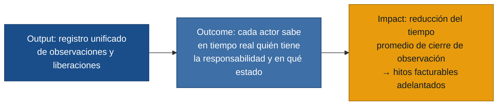

# User Stories — Liberaciones de Obra

Generado el 2026-06-21. Fuente: `personas.md`, `requisitos.md`, `evidence-map.json`.

Las historias están ordenadas por prioridad MVP: primero las que atacan el núcleo de valor
(observaciones por canales informales → sin visibilidad de estado → bloqueos de actividad → pérdida de facturación).

---

## Cadena de valor del MVP

---

## MVP — Núcleo de valor (prioridad alta)

### [US-01] Registrar observación con evidencia fotográfica desde campo

- **Historia:** Como **Inspector de Calidad**, quiero registrar una observación con foto, descripción, responsable de corrección y fecha compromiso directamente desde mi celular durante la inspección, para no tener que ordenar fotos y mensajes al cierre del día.
- **Criterios de aceptación:**
  - Dado que estoy en campo inspeccionando una actividad, cuando completo el formulario de observación y adjunto al menos una foto, entonces la observación queda guardada vinculada al código de actividad/frente con mi identidad y la marca de tiempo exacta.
  - Dado que se creó la observación, cuando la guardo, entonces el Residente de Obra y el Jefe de Proyecto ven la nueva observación abierta en su vista de estado.
  - Dado que el formulario está abierto, cuando intento guardarlo sin foto adjunta, entonces el sistema muestra un aviso y no permite guardar sin evidencia fotográfica.
- **Fuente:** `inspector_calidad.md` (fotos-sin-referencia, observaciones-sin-registro-formal)
- **Requisitos:** R-02, R-05, R-06

---

### [US-02] Ver el estado actual de cada actividad y quién tiene la responsabilidad

- **Historia:** Como **Residente de Obra**, quiero ver en una sola pantalla qué actividades están solicitadas, observadas, corregidas o liberadas y quién tiene la pelota en cada momento, para planificar el día siguiente sin sorpresas ni pérdida de horas-hombre.
- **Criterios de aceptación:**
  - Dado que abro la vista de frentes, cuando selecciono un frente, entonces veo cada actividad con su estado actual (solicitado / observado / corregido / liberado) y el nombre del responsable en turno.
  - Dado que una actividad cambia de estado, cuando ocurre el cambio, entonces la vista refleja el nuevo estado sin requerir refresco manual.
  - Dado que hay actividades observadas con fecha compromiso vencida, cuando abro la vista, entonces esas actividades aparecen visualmente diferenciadas como vencidas.
- **Fuente:** `residente_obra.md` (actividades-bloqueadas-sin-saberlo, sin-visibilidad-de-quien-tiene-pelota), `jefe_proyecto.md` (sin-foto-unica)
- **Requisitos:** R-03, R-07

---

### [US-03] Aprobar o rechazar una liberación con evidencia vinculada

- **Historia:** Como **Fiscalizador del Cliente**, quiero revisar la solicitud de liberación de una actividad con sus fotos de observación y de corrección vinculadas, y aprobarla con mi firma digital, para tener respaldo trazable ante auditorías sin depender de mensajes de WhatsApp.
- **Criterios de aceptación:**
  - Dado que una actividad está en estado "corregido", cuando abro la solicitud, entonces veo la descripción del punto, la foto de la observación original y la foto de la corrección, el responsable de cada cambio y la fecha y hora de cada acción.
  - Dado que la evidencia está completa, cuando apruebo la liberación, entonces el estado cambia a "liberado" y quedan registrados mi identidad, la fecha y la hora, vinculados a esa evidencia de forma inmutable.
  - Dado que falta algún documento requerido, cuando intento aprobar, entonces el sistema no permite avanzar y muestra qué falta.
- **Fuente:** `fiscalizador_cliente.md` (informacion-incompleta-para-aprobar, sin-valor-documental), `inspector_calidad.md` (cierre-observaciones-sin-control-de-rol)
- **Requisitos:** R-04, R-06, R-12

---

### [US-04] Gestionar todas las observaciones en un canal único

- **Historia:** Como **Residente de Obra**, quiero recibir todas las observaciones de la inspección dentro del sistema, para no tener que rastrear mensajes de WhatsApp, correos y minutas que generan versiones conflictivas y observaciones repetidas.
- **Criterios de aceptación:**
  - Dado que el Inspector registra una observación, cuando la guarda en el sistema, entonces aparece automáticamente en mi bandeja de observaciones pendientes de corrección.
  - Dado que actualizo el estado de corrección de una observación, cuando lo guardo, entonces el Inspector y el Fiscalizador ven el cambio sin que yo tenga que avisar por otro canal.
  - Dado que busco una observación anterior, cuando filtro por frente o actividad, entonces encuentro el registro completo con historial de cambios sin tener que buscar en chats.
- **Fuente:** `residente_obra.md` (observaciones-por-chat, observaciones-repetidas), `fiscalizador_cliente.md` (multiples-canales)
- **Requisitos:** R-11, R-06

---

### [US-05] Controlar qué roles pueden cerrar una observación

- **Historia:** Como **Inspector de Calidad**, quiero que solo calidad o el fiscalizador del cliente puedan cambiar el estado de una observación a "liberado", para que producción no cierre puntos sin haber hecho la corrección real.
- **Criterios de aceptación:**
  - Dado que un usuario con rol de residente/producción intenta cambiar el estado de una observación a "liberado", cuando realiza la acción, entonces el sistema la bloquea y muestra un mensaje indicando el rol requerido.
  - Dado que un usuario con rol de calidad o fiscalizador cierra una observación, cuando lo hace, entonces quedan registrados su nombre, rol y la marca de tiempo exacta.
- **Fuente:** `inspector_calidad.md` (cierre-observaciones-sin-control-de-rol)
- **Requisitos:** R-04, R-06

---

### [US-06] Registrar y sincronizar observaciones sin conexión a internet

- **Historia:** Como **Inspector de Calidad**, quiero poder registrar observaciones con fotos aunque no haya internet en el frente, para no tener que volver al papel cuando la señal falla.
- **Criterios de aceptación:**
  - Dado que no hay conectividad, cuando registro una observación con foto, entonces se guarda localmente con un indicador visible de "pendiente de sincronización".
  - Dado que se recupera la conectividad, cuando el dispositivo vuelve a tener internet, entonces los registros pendientes se sincronizan automáticamente sin acción de mi parte.
  - Dado que se sincronizó un registro offline, cuando consulto el historial, entonces aparece con la marca de tiempo original del registro en campo, no la de la sincronización.
- **Fuente:** `inspector_calidad.md` (sin-modo-offline)
- **Requisitos:** R-16

---

## MVP — Visibilidad de gestión (prioridad media)

### [US-07] Ver tablero de control con bloqueos críticos

- **Historia:** Como **Jefe de Proyecto**, quiero ver un tablero con las liberaciones agrupadas por estado y las observaciones vencidas resaltadas, para saber qué está bloqueando el siguiente hito facturable sin preguntar a cada área.
- **Criterios de aceptación:**
  - Dado que abro el tablero, cuando carga la vista, entonces veo el conteo de liberaciones por estado (solicitadas, observadas, corregidas, liberadas) y el listado de observaciones con fecha compromiso vencida.
  - Dado que hay observaciones críticas abiertas, cuando las veo en el tablero, entonces identifico el frente, el responsable actual y los días de atraso sin hacer clic adicional.
  - Dado que quiero escalar una observación, cuando la selecciono, entonces puedo marcarla como crítica, lo que la resalta para todos los actores con acceso al tablero.
- **Fuente:** `jefe_proyecto.md` (no-saber-bloqueo-critico, avance-no-facturable, datos-manuales-con-discusion)
- **Requisitos:** R-08, R-09, R-13, R-14

---

### [US-08] Usar nomenclatura consistente de catálogo para frentes y actividades

- **Historia:** Como **Coordinadora Documental**, quiero que el sistema use los mismos códigos de frente y actividad en solicitudes, fotos y protocolos, para no tener que reconciliar nombres distintos al armar un dossier.
- **Criterios de aceptación:**
  - Dado que un inspector registra una observación, cuando selecciona el frente y la actividad, entonces elige de un catálogo centralizado (no escribe texto libre), de modo que el código es idéntico en todos los registros del sistema.
  - Dado que se adjuntan fotos a una observación, cuando se guardan, entonces quedan vinculadas al código de actividad del catálogo, no a un nombre escrito a mano.
- **Fuente:** `coordinador_documental.md` (inconsistencia-nomenclaturas)
- **Requisitos:** R-15

---

## Fuera de alcance del MVP

Las siguientes historias están respaldadas por evidencia real pero quedan fuera porque no atacan el núcleo de valor o dependen de que el flujo digital base ya esté adoptado:

| Historia | Motivo de exclusión |
|---|---|
| Exportar reporte por frente en PDF/Excel (R-10) | Útil para la Coordinadora Documental, pero el valor central es el flujo de registro, no el reporte. Se agrega en la siguiente iteración una vez que existan datos acumulados. |
| Ranking de responsables y días promedio de cierre (R-09 parcial) | Requiere historial en el sistema; no aplica en el primer mes de adopción. |
| Descarga autónoma de evidencia por el fiscalizador (R-19) | El fiscalizador accede a la evidencia desde el sistema; la descarga masiva es comodidad, no bloqueo del flujo principal. |
| Indicador diario automático al inicio de jornada (R-14 parcial) | Cubierto parcialmente por el tablero (US-07); la notificación push activa se deja para la siguiente iteración cuando haya base de usuarios. |
